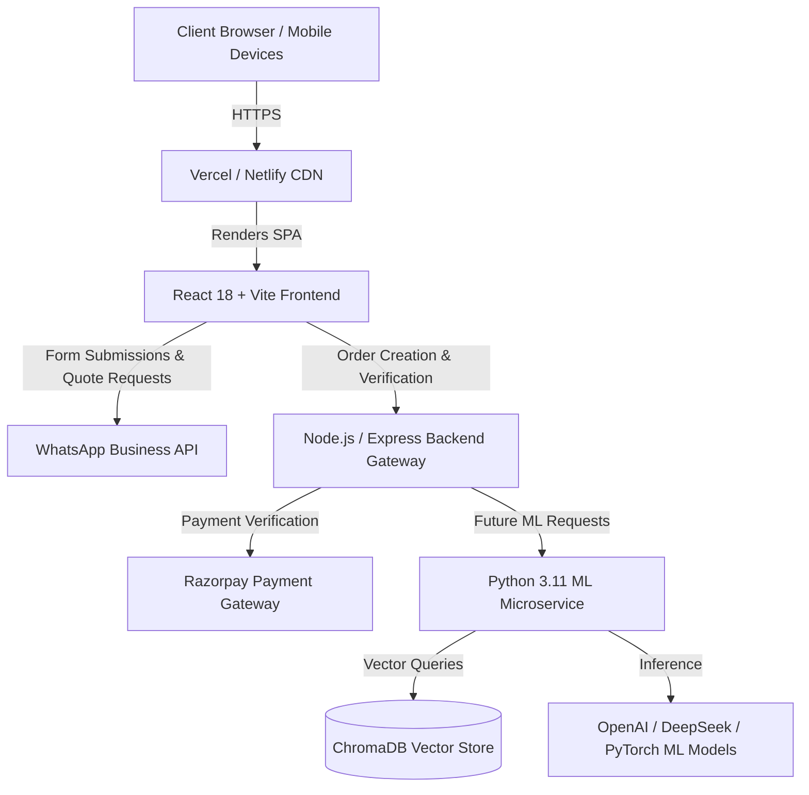

# VINKS System Architecture Specifications

> **System Name**: VINKS Official Web Application  
> **Repository**: [github.com/Naziran7/vinks.com](https://github.com/Naziran7/vinks.com)  

---

## 🏛️ System Overview

VINKS is built as a highly responsive, modern full-stack web application designed to showcase technology offerings, automate quote calculations, deliver live portfolio previews, and handle instant WhatsApp / UPI payment integrations.

The architecture follows a decoupled, single-page application (SPA) design with an Express API gateway and a clear upgrade path toward dedicated Python Machine Learning microservices.

---

## 📐 High-Level Architecture Diagram



---

## 📂 Component Hierarchy & Responsibilities

```
src/
├── main.tsx                # Application Entry Point & React DOM Render
├── App.tsx                 # Root Layout & State Orchestrator
├── index.css               # Design System, Glassmorphism, Tailwind Directives
│
├── config/
│   └── siteConfig.ts       # Central Single-Source-of-Truth Metadata File
│
└── components/
    ├── Navbar.tsx          # Responsive Header Navigation & Mobile Drawer
    ├── Hero.tsx            # Canvas Particle Animation & Main CTA Section
    ├── TargetCustomers.tsx # Segment Cards (Students, Startups, Businesses)
    ├── Services.tsx        # 8 Core Offering Cards + Interactive Detail Modals
    ├── HowItWorks.tsx      # 7-Step Development Pipeline Workflow
    ├── Projects.tsx        # Interactive Portfolio Grid & Case Study Links
    ├── LiveDemoModal.tsx   # Simulated Multi-Device (Mobile/Desktop) Demo Viewer
    ├── Pricing.tsx         # 4 Package Tiers (Starter, Project, Business, AI)
    ├── CustomQuoteForm.tsx # Dynamic Price Estimator & WhatsApp Generator
    ├── About.tsx           # Company Story, Pipeline Ribbon & Offering Grid
    ├── WhyChooseUs.tsx     # Value Proposition Grid
    ├── Contact.tsx         # Direct Contact Channels (Email, Phone, WhatsApp)
    ├── Footer.tsx          # 4-Column Footer Navigation & Policy Triggers
    └── LegalModals.tsx     # Privacy Policy, Terms of Service, Refund Policy Modals
```

---

## 🔄 Data & State Flow

1. **Config-Driven Architecture**:
   All static messaging, pricing tiers, social URLs, contact phone/email values, and project items are centralized in `src/config/siteConfig.ts`. Modifying `siteConfig.ts` instantly updates all components across the entire application.

2. **Interactive Form & State Sync**:
   When a user clicks "Get Custom Quote" on any service or pricing card, `App.tsx` captures the selected `projectType` and `discountCode` and smoothly scrolls down to `#contact`. `CustomQuoteForm.tsx` updates via `useEffect` hooks and automatically pre-populates default budget ranges.

3. **WhatsApp Link Generation**:
   Quotes generate a unique Reference ID (`VINGS-Q-XXXXXX`), construct a formatted Markdown payload, encode the URL string, and open `https://wa.me/919845820117?text=...` directly.

---

## 🔐 Environment Variables & Security

| Variable | Scope | Purpose |
| :--- | :--- | :--- |
| `VITE_APP_TITLE` | Frontend | Application browser title override |
| `RAZORPAY_KEY_ID` | Backend Server | Razorpay Merchant ID for UPI payment order creation |
| `RAZORPAY_KEY_SECRET` | Backend Server | Razorpay Secret Key for HMAC signature verification |
| `OPENAI_API_KEY` | ML Microservice | OpenAI API Key for RAG embedding & LLM inference |

---

*Architectural Documentation maintained by VINKS Development Team.*
